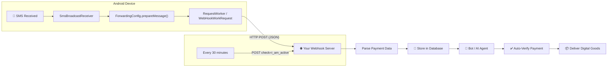
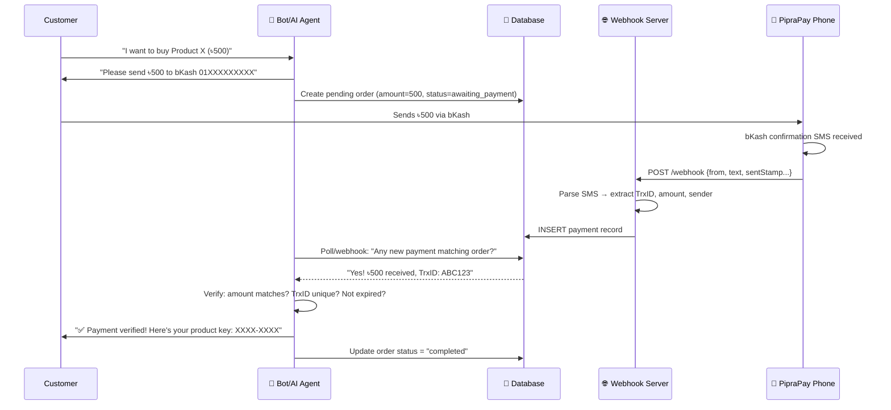

# PipraPay V2 — Open Source Android SMS Forwarding App

PipraPay V2 is an open-source Android application designed to forward incoming SMS messages (such as bKash, Nagad, and Rocket payment confirmations) to your custom webhook server. 

This repository contains the complete Android application source code. It is intended to be used alongside a backend bot or AI agent to automate payment verification and digital goods delivery.

## 📝 Disclaimer & Our Use Case

**Trademark Notice**: The PipraPay name, logo, and overall brand identity are trademarks of QubePlug Bangladesh. This is a modified fork designed specifically to integrate with our self-hosted AI agent bot project. Please see [TRADEMARK.md](TRADEMARK.md) for full trademark policies.

**Why we use this approach:**
We built this integration because getting official Merchant APIs for bKash and Nagad for auto-payment verification is currently very difficult or unavailable for small projects. Setting up the complete, official PipraPay payment portal dashboard was too lengthy of a process just to verify client payments for our AI agent customer support service. 

Instead, we forked the PipraPay app source and integrated the webhook logic *directly* into our existing AI bot server. This allows us to bypass building a separate payment dashboard (since we already have one for our AI agent portal) while still achieving 100% automated payment verification. We are sharing this approach because many other developers face the same issue with MFS automation in Bangladesh!

## 🚀 Features

- **Reliable SMS Forwarding**: Runs as a persistent foreground service to catch all incoming SMS.
- **Offline Resilience**: Uses Android WorkManager to queue webhooks and automatically retry with exponential backoff if the network is down.
- **Customizable Payloads**: Supports custom JSON templates with placeholders (`%from%`, `%text%`, `%sentStamp%`, `%receivedStamp%`, `%sim%`).
- **Heartbeat Monitoring**: Sends connection status updates every 30 minutes to ensure your devices remain online.
- **Multi-SIM Support**: Automatically detects which SIM received the SMS.

## 🛠️ How to Build and Install

1. Clone this repository to your local machine.
2. Open the project in **Android Studio**.
3. Let Gradle sync dependencies, then build the APK (`Build > Build Bundle(s) / APK(s) > Build APK(s)`).
4. Install the APK on your Android device.
5. Open the app, grant SMS permissions, and disable battery optimizations.

---

## 📖 Webhook API Documentation

> Complete reference for integrating PipraPay's SMS forwarding system with your server-side bot/AI agent for automated payment verification and digital goods delivery.

### Table of Contents

- [Architecture Overview](#architecture-overview)
- [How the App Works](#how-the-app-works)
- [API Endpoints Your Server Must Implement](#api-endpoints-your-server-must-implement)
  - [1. SMS Webhook (Core)](#1-sms-webhook-core)
  - [2. Connection Status / Heartbeat](#2-connection-status--heartbeat)
  - [3. Config Validation (Add/Edit/Delete)](#3-config-validation-addeditdelete)
- [Template Placeholders](#template-placeholders)
- [Default Payload & Headers](#default-payload--headers)
- [Server Response Format](#server-response-format)
- [Retry & Reliability](#retry--reliability)
- [Full Integration Examples](#full-integration-examples)
  - [Node.js/Express Server](#nodejs--express-server)
  - [Python/Flask Server](#python--flask-server)
  - [PHP Server](#php-server)
- [Payment SMS Parsing Examples](#payment-sms-parsing-examples)
  - [bKash](#bkash)
  - [Nagad](#nagad)
  - [Rocket](#rocket)
- [Bot/AI Agent Integration Blueprint](#botai-agent-integration-blueprint)
- [Database Schema Recommendation](#database-schema-recommendation)
- [Security Considerations](#security-considerations)
- [Troubleshooting](#troubleshooting)

---

### Architecture Overview



---

### How the App Works

#### Component Flow (Step-by-Step)

| Step | Component | What Happens |
|------|-----------|-------------|
| 1 | `AndroidManifest.xml` | Declares `RECEIVE_SMS`, `INTERNET`, `FOREGROUND_SERVICE` permissions |
| 2 | `BootCompletedReceiver` | On device boot → auto-starts `SmsReceiverService` as foreground service |
| 3 | `SmsReceiverService` | Runs as persistent foreground service, registers `SmsBroadcastReceiver` for `SMS_RECEIVED_ACTION` |
| 4 | `SmsBroadcastReceiver.onReceive()` | Intercepts every incoming SMS, extracts sender + message body + SIM slot + timestamp |
| 5 | `ForwardingConfig.getAll()` | Loads all saved webhook configs from SharedPreferences |
| 6 | **Sender Matching** | Matches SMS sender against config's sender filter. `*` (asterisk) = catch **all** SMS |
| 7 | `ForwardingConfig.prepareMessage()` | Replaces template placeholders (`%from%`, `%text%`, etc.) with actual SMS data |
| 8 | `RequestWorker.doWork()` | Enqueued via Android WorkManager → makes HTTP POST to webhook URL with JSON payload |
| 9 | `Request.execute()` | Low-level HTTP POST with custom headers, SSL handling, chunked transfer encoding |
| 10 | **Heartbeat** | Every 30 minutes, sends `check=i_am_active` POST to all configured URLs (from `MainActivity`) |

#### Key Design Decisions

- **WorkManager** guarantees delivery even if the device loses network temporarily (auto-retries with exponential backoff)
- **Foreground Service** keeps the SMS listener alive even when the app is closed
- **Boot Receiver** auto-starts on device reboot
- SMS text is **JSON-escaped** using `StringEscapeUtils.escapeJson()` before being placed into the template

---

### API Endpoints Your Server Must Implement

#### 1. SMS Webhook (Core)

This is the **primary endpoint** — it receives forwarded SMS data from the phone.

> [!IMPORTANT]
> This is the most critical endpoint. Every payment SMS (bKash, Nagad, Rocket, etc.) arrives here as a JSON POST.

**Request:**

```
POST <your-webhook-url>
Content-Type: application/json; charset=utf-8
User-agent: mh-piprapay-api-key
```

**Default JSON Body:**

```json
{
  "from": "+8801XXXXXXXXX",
  "text": "You have received Tk 500.00 from 01712345678. Fee Tk 0.00. Balance Tk 1,250.00. TrxID ABC123XYZ at 01/07/2026 14:30.",
  "sentStamp": 1751366400000,
  "receivedStamp": 1751366401234,
  "sim": "sim1"
}
```

**Field Reference:**

| Field | Type | Description |
|-------|------|-------------|
| `from` | `string` | SMS sender address (phone number or alphanumeric sender ID like `bKash`, `Nagad`, `16216`) |
| `text` | `string` | Full SMS body, JSON-escaped. Contains the payment details to parse |
| `sentStamp` | `number` | Unix timestamp in **milliseconds** — when the SMS was sent by the carrier |
| `receivedStamp` | `number` | Unix timestamp in **milliseconds** — when the phone received the SMS |
| `sim` | `string` | SIM slot that received the SMS: `"sim1"`, `"sim2"`, or `"undetected"` |

**Expected Response:**

```
HTTP 2xx (any 2xx status code)
```

The app only checks if the HTTP response code starts with `2`. Any 2xx = success. Non-2xx = triggers retry.

---

#### 2. Connection Status / Heartbeat

The app sends a heartbeat every **30 minutes** to confirm the device is alive and connected. Additionally, the same endpoint receives connection/disconnection status updates when adding, editing, or deleting webhook configs.

**Request (Heartbeat — every 30 minutes):**

```
POST <your-webhook-url>
Content-Type: application/x-www-form-urlencoded
```

**Form Parameters (Heartbeat):**

| Parameter | Type | Example | Description |
|-----------|------|---------|-------------|
| `check` | `string` | `"i_am_active"` | Heartbeat signal identifier |
| `d_model` | `string` | `"SM-A515F"` | Device model name |
| `d_brand` | `string` | `"samsung"` | Device brand |
| `d_version` | `string` | `"13"` | Android version |
| `d_api_level` | `string` | `"33"` | Android API level |

**Request (Connection Status — on config add/edit):**

```
POST <your-webhook-url>
Content-Type: application/x-www-form-urlencoded
```

| Parameter | Type | Example | Description |
|-----------|------|---------|-------------|
| `d_model` | `string` | `"SM-A515F"` | Device model name |
| `d_brand` | `string` | `"samsung"` | Device brand |
| `d_version` | `string` | `"13"` | Android version |
| `d_api_level` | `string` | `"33"` | Android API level |
| `connection_status` | `string` | `"Connected"` or `"Disconnected"` | Current connection status |

> [!TIP]
> **How to distinguish request types on your server:**
> - If `check` parameter exists → It's a **heartbeat**
> - If `connection_status` parameter exists → It's a **config status update**
> - If `Content-Type` is `application/json` → It's an **SMS webhook** payload

---

#### 3. Config Validation (Add/Edit/Delete)

When users add, edit, or delete a webhook config in the app, it sends a POST to the webhook URL first. The server must respond with a specific JSON format to approve/deny the operation.

**Expected Response Format:**

```json
{
  "status": "true",
  "message": "✅ Webhook connected successfully!"
}
```

or to deny:

```json
{
  "status": "false",
  "message": "❌ Invalid API key"
}
```

| Field | Type | Description |
|-------|------|-------------|
| `status` | `string` | `"true"` to approve, `"false"` to deny |
| `message` | `string` | Message displayed to the user in the app |

> [!WARNING]
> The `status` field is a **string** (`"true"` / `"false"`), NOT a boolean. The app uses `"true".equalsIgnoreCase(status)` to check.

---

### Template Placeholders

The JSON template used in the app supports these placeholders that get replaced at runtime:

| Placeholder | Replaced With | Example |
|-------------|---------------|---------|
| `%from%` | SMS sender address | `"bKash"`, `"+8801712345678"`, `"16216"` |
| `%text%` | Full SMS body (JSON-escaped) | `"You have received Tk 500.00 from..."` |
| `%sentStamp%` | Carrier send timestamp (ms) | `1751366400000` |
| `%receivedStamp%` | Device receive timestamp (ms) | `1751366401234` |
| `%sim%` | SIM slot identifier | `"sim1"`, `"sim2"`, `"undetected"` |

#### Custom Template Example

You can customize the template in the app. For example, adding extra fields for your bot:

```json
{
  "from": "%from%",
  "text": "%text%",
  "sentStamp": %sentStamp%,
  "receivedStamp": %receivedStamp%,
  "sim": "%sim%",
  "device": "payment-phone-01",
  "api_key": "your-secret-key-here"
}
```

---

### Default Payload & Headers

#### Default JSON Template
```json
{
  "from": "%from%",
  "text": "%text%",
  "sentStamp": %sentStamp%,
  "receivedStamp": %receivedStamp%,
  "sim": "%sim%"
}
```

#### Default Headers
```json
{
  "User-agent": "mh-piprapay-api-key"
}
```

> [!NOTE]
> The `Content-Type: application/json; charset=utf-8` header is always set by the app regardless of custom headers. Custom headers are **merged** on top.

---

### Server Response Format

#### For SMS Webhook
Any `2xx` HTTP status = success. The body content doesn't matter.

#### For Config Operations (Add/Edit/Delete)
Must return JSON:

```json
{
  "status": "true",
  "message": "Human-readable message shown in app"
}
```

---

### Retry & Reliability

| Setting | Value | Notes |
|---------|-------|-------|
| Default max retries | `10` (configurable per config) | Set in the app UI |
| Backoff strategy | **Exponential** | Android WorkManager default |
| Minimum backoff | `10,000 ms` (10 seconds) | `OneTimeWorkRequest.MIN_BACKOFF_MILLIS` |
| Network constraint | `NetworkType.CONNECTED` | Won't attempt if no network |
| Heartbeat interval | `30 minutes` (1,800,000 ms) | Checks all configured URLs |

> [!TIP]
> Failed webhook deliveries are automatically retried by WorkManager with exponential backoff. A request that initially fails will retry at ~10s, ~20s, ~40s, ~80s... intervals up to the max retry count.

---

### Full Integration Examples

#### Node.js / Express Server

```javascript
const express = require('express');
const app = express();

// Parse both JSON and URL-encoded bodies
app.use(express.json());
app.use(express.urlencoded({ extended: true }));

// ============================================
// MAIN WEBHOOK ENDPOINT
// Handles: SMS data, Heartbeats, Config ops
// ============================================
app.post('/piprapay/webhook', (req, res) => {
  
  // --- HEARTBEAT ---
  if (req.body.check === 'i_am_active') {
    console.log(`💓 Heartbeat from ${req.body.d_brand} ${req.body.d_model} (Android ${req.body.d_version})`);
    
    // Update device last-seen timestamp in your DB
    updateDeviceStatus({
      model: req.body.d_model,
      brand: req.body.d_brand,
      version: req.body.d_version,
      lastSeen: new Date()
    });
    
    return res.status(200).json({
      status: 'true',
      message: 'Heartbeat received'
    });
  }

  // --- CONFIG CONNECTION STATUS ---
  if (req.body.connection_status) {
    console.log(`📡 Device ${req.body.d_brand} ${req.body.d_model}: ${req.body.connection_status}`);
    
    return res.status(200).json({
      status: 'true',
      message: `✅ Device ${req.body.connection_status}`
    });
  }

  // --- SMS WEBHOOK (Payment Data) ---
  const { from, text, sentStamp, receivedStamp, sim } = req.body;
  
  console.log(`📩 SMS from: ${from}`);
  console.log(`📝 Text: ${text}`);
  console.log(`⏰ Sent: ${new Date(sentStamp)} | Received: ${new Date(receivedStamp)}`);
  console.log(`📱 SIM: ${sim}`);

  // Parse payment details from SMS text
  const paymentData = parsePaymentSMS(from, text);
  
  if (paymentData) {
    // Store in database
    savePayment({
      ...paymentData,
      rawSms: text,
      senderAddress: from,
      sentAt: new Date(sentStamp),
      receivedAt: new Date(receivedStamp),
      simSlot: sim,
      status: 'pending_verification'
    });

    console.log('✅ Payment recorded:', paymentData);
  }

  // Return 200 to acknowledge receipt
  res.status(200).json({ status: 'success' });
});


// ============================================
// PAYMENT SMS PARSER
// ============================================
function parsePaymentSMS(sender, text) {
  const result = {
    provider: null,
    type: null,         // 'received' | 'sent' | 'cashout'
    amount: null,
    trxId: null,
    senderNumber: null,
    balance: null,
    fee: null,
    timestamp: null
  };

  // --- bKash ---
  if (sender.includes('bKash') || sender === '16247') {
    result.provider = 'bkash';
    
    // Received money
    const receivedMatch = text.match(
      /received\s+Tk\s+([\d,]+\.?\d*)\s+from\s+(\d+).*?Fee\s+Tk\s+([\d,]+\.?\d*).*?Balance\s+Tk\s+([\d,]+\.?\d*).*?TrxID\s+(\w+)/i
    );
    if (receivedMatch) {
      result.type = 'received';
      result.amount = parseFloat(receivedMatch[1].replace(/,/g, ''));
      result.senderNumber = receivedMatch[2];
      result.fee = parseFloat(receivedMatch[3].replace(/,/g, ''));
      result.balance = parseFloat(receivedMatch[4].replace(/,/g, ''));
      result.trxId = receivedMatch[5];
    }

    // Payment received (merchant)
    const paymentMatch = text.match(
      /payment\s+of\s+Tk\s+([\d,]+\.?\d*)\s+from\s+(\d+).*?TrxID\s+(\w+)/i
    );
    if (paymentMatch) {
      result.type = 'received';
      result.amount = parseFloat(paymentMatch[1].replace(/,/g, ''));
      result.senderNumber = paymentMatch[2];
      result.trxId = paymentMatch[3];
    }

    return result.trxId ? result : null;
  }

  // --- Nagad ---
  if (sender.includes('Nagad') || sender === '16167') {
    result.provider = 'nagad';
    
    const receivedMatch = text.match(
      /received\s+Tk\.([\d,]+\.?\d*)\s+from.*?(\d{11}).*?TxnID[:\s]*(\w+)/i
    );
    if (receivedMatch) {
      result.type = 'received';
      result.amount = parseFloat(receivedMatch[1].replace(/,/g, ''));
      result.senderNumber = receivedMatch[2];
      result.trxId = receivedMatch[3];
    }

    return result.trxId ? result : null;
  }

  // --- Rocket (DBBL) ---
  if (sender.includes('16216') || sender.includes('Rocket')) {
    result.provider = 'rocket';
    
    const receivedMatch = text.match(
      /received\s+Tk\s+([\d,]+\.?\d*)\s+from\s+(\d+).*?TxnId[:\s]*(\w+)/i
    );
    if (receivedMatch) {
      result.type = 'received';
      result.amount = parseFloat(receivedMatch[1].replace(/,/g, ''));
      result.senderNumber = receivedMatch[2];
      result.trxId = receivedMatch[3];
    }

    return result.trxId ? result : null;
  }

  return null;
}


// Placeholder DB functions
async function savePayment(data) {
  // Implement your database insert here
  console.log('💾 Saving payment:', JSON.stringify(data, null, 2));
}

async function updateDeviceStatus(data) {
  // Implement your device status update here
  console.log('📡 Device status update:', JSON.stringify(data));
}


app.listen(3000, () => {
  console.log('🚀 PipraPay Webhook Server running on port 3000');
});
```

#### Python / Flask Server

```python
from flask import Flask, request, jsonify
import re
import json
from datetime import datetime

app = Flask(__name__)

@app.route('/piprapay/webhook', methods=['POST'])
def webhook():
    # --- HEARTBEAT (form-encoded) ---
    if request.form.get('check') == 'i_am_active':
        print(f"💓 Heartbeat: {request.form.get('d_brand')} {request.form.get('d_model')}")
        return jsonify({"status": "true", "message": "Heartbeat received"}), 200

    # --- CONFIG STATUS (form-encoded) ---
    if request.form.get('connection_status'):
        status = request.form.get('connection_status')
        print(f"📡 Device status: {status}")
        return jsonify({"status": "true", "message": f"✅ {status}"}), 200

    # --- SMS WEBHOOK (JSON body) ---
    data = request.get_json(silent=True)
    if not data:
        return jsonify({"error": "No JSON body"}), 400

    sender = data.get('from', '')
    text = data.get('text', '')
    sent_stamp = data.get('sentStamp', 0)
    received_stamp = data.get('receivedStamp', 0)
    sim = data.get('sim', 'undetected')

    print(f"📩 SMS from: {sender}")
    print(f"📝 Text: {text}")
    print(f"📱 SIM: {sim}")

    # Parse payment
    payment = parse_payment_sms(sender, text)
    if payment:
        payment.update({
            'raw_sms': text,
            'sender_address': sender,
            'sent_at': datetime.fromtimestamp(sent_stamp / 1000).isoformat(),
            'received_at': datetime.fromtimestamp(received_stamp / 1000).isoformat(),
            'sim_slot': sim,
            'status': 'pending_verification'
        })
        print(f"✅ Payment recorded: {json.dumps(payment, indent=2)}")
        # save_payment_to_db(payment)

    return jsonify({"status": "success"}), 200


def parse_payment_sms(sender, text):
    """Parse payment details from SMS text."""
    
    # bKash
    if 'bKash' in sender or sender == '16247':
        match = re.search(
            r'received\s+Tk\s+([\d,]+\.?\d*)\s+from\s+(\d+).*?'
            r'Fee\s+Tk\s+([\d,]+\.?\d*).*?'
            r'Balance\s+Tk\s+([\d,]+\.?\d*).*?'
            r'TrxID\s+(\w+)', text, re.IGNORECASE
        )
        if match:
            return {
                'provider': 'bkash',
                'type': 'received',
                'amount': float(match.group(1).replace(',', '')),
                'sender_number': match.group(2),
                'fee': float(match.group(3).replace(',', '')),
                'balance': float(match.group(4).replace(',', '')),
                'trx_id': match.group(5)
            }

    # Nagad
    if 'Nagad' in sender or sender == '16167':
        match = re.search(
            r'received\s+Tk\.([\d,]+\.?\d*)\s+from.*?(\d{11}).*?TxnID[:\s]*(\w+)',
            text, re.IGNORECASE
        )
        if match:
            return {
                'provider': 'nagad',
                'type': 'received',
                'amount': float(match.group(1).replace(',', '')),
                'sender_number': match.group(2),
                'trx_id': match.group(3)
            }

    # Rocket
    if '16216' in sender or 'Rocket' in sender:
        match = re.search(
            r'received\s+Tk\s+([\d,]+\.?\d*)\s+from\s+(\d+).*?TxnId[:\s]*(\w+)',
            text, re.IGNORECASE
        )
        if match:
            return {
                'provider': 'rocket',
                'type': 'received',
                'amount': float(match.group(1).replace(',', '')),
                'sender_number': match.group(2),
                'trx_id': match.group(3)
            }

    return None


if __name__ == '__main__':
    app.run(host='0.0.0.0', port=3000, debug=True)
```

#### PHP Server

```php
<?php
header('Content-Type: application/json');

// Read both POST form data and JSON body
$formData = $_POST;
$jsonData = json_decode(file_get_contents('php://input'), true);

// --- HEARTBEAT ---
if (isset($formData['check']) && $formData['check'] === 'i_am_active') {
    error_log("💓 Heartbeat from {$formData['d_brand']} {$formData['d_model']}");
    
    echo json_encode([
        'status' => 'true',
        'message' => 'Heartbeat received'
    ]);
    exit;
}

// --- CONFIG STATUS ---
if (isset($formData['connection_status'])) {
    $status = $formData['connection_status'];
    error_log("📡 Device status: {$status}");
    
    echo json_encode([
        'status' => 'true',
        'message' => "✅ Device {$status}"
    ]);
    exit;
}

// --- SMS WEBHOOK ---
if ($jsonData && isset($jsonData['from'])) {
    $from = $jsonData['from'];
    $text = $jsonData['text'];
    $sentStamp = $jsonData['sentStamp'];
    $receivedStamp = $jsonData['receivedStamp'];
    $sim = $jsonData['sim'];

    error_log("📩 SMS from: {$from} | Text: {$text}");

    // Parse payment
    $payment = parsePaymentSMS($from, $text);
    
    if ($payment) {
        $payment['raw_sms'] = $text;
        $payment['sender_address'] = $from;
        $payment['sent_at'] = date('Y-m-d H:i:s', $sentStamp / 1000);
        $payment['received_at'] = date('Y-m-d H:i:s', $receivedStamp / 1000);
        $payment['sim_slot'] = $sim;
        $payment['status'] = 'pending_verification';
        
        // Save to database
        // savePayment($payment);
        
        error_log("✅ Payment: " . json_encode($payment));
    }

    echo json_encode(['status' => 'success']);
    exit;
}

echo json_encode(['error' => 'Unknown request']);

function parsePaymentSMS($sender, $text) {
    // bKash
    if (stripos($sender, 'bKash') !== false || $sender === '16247') {
        if (preg_match('/received\s+Tk\s+([\d,]+\.?\d*)\s+from\s+(\d+).*?Fee\s+Tk\s+([\d,]+\.?\d*).*?Balance\s+Tk\s+([\d,]+\.?\d*).*?TrxID\s+(\w+)/i', $text, $m)) {
            return [
                'provider' => 'bkash',
                'type' => 'received',
                'amount' => floatval(str_replace(',', '', $m[1])),
                'sender_number' => $m[2],
                'fee' => floatval(str_replace(',', '', $m[3])),
                'balance' => floatval(str_replace(',', '', $m[4])),
                'trx_id' => $m[5]
            ];
        }
    }

    // Nagad
    if (stripos($sender, 'Nagad') !== false || $sender === '16167') {
        if (preg_match('/received\s+Tk\.([\d,]+\.?\d*)\s+from.*?(\d{11}).*?TxnID[:\s]*(\w+)/i', $text, $m)) {
            return [
                'provider' => 'nagad',
                'type' => 'received',
                'amount' => floatval(str_replace(',', '', $m[1])),
                'sender_number' => $m[2],
                'trx_id' => $m[3]
            ];
        }
    }

    // Rocket
    if (strpos($sender, '16216') !== false || stripos($sender, 'Rocket') !== false) {
        if (preg_match('/received\s+Tk\s+([\d,]+\.?\d*)\s+from\s+(\d+).*?TxnId[:\s]*(\w+)/i', $text, $m)) {
            return [
                'provider' => 'rocket',
                'type' => 'received',
                'amount' => floatval(str_replace(',', '', $m[1])),
                'sender_number' => $m[2],
                'trx_id' => $m[3]
            ];
        }
    }

    return null;
}
?>
```

---

### Payment SMS Parsing Examples

#### bKash

**Sample SMS (Received Money):**
```
You have received Tk 500.00 from 01712345678. Fee Tk 0.00. Balance Tk 1,250.00. TrxID ABC123XYZ at 01/07/2026 14:30.
```

**Parsed Output:**
```json
{
  "provider": "bkash",
  "type": "received",
  "amount": 500.00,
  "sender_number": "01712345678",
  "fee": 0.00,
  "balance": 1250.00,
  "trx_id": "ABC123XYZ"
}
```

**Sample SMS (Payment Received - Merchant):**
```
You have received payment of Tk 1,000.00 from 01812345678. TrxID DEF456GHI. Your bKash a/c balance is Tk 5,250.00.
```

---

#### Nagad

**Sample SMS (Received Money):**
```
You have received Tk.300.00 from A/C 01912345678 (Ref: payment). TxnID: 9AB2CD3EFG. Balance Tk.2,100.00.
```

**Parsed Output:**
```json
{
  "provider": "nagad",
  "type": "received",
  "amount": 300.00,
  "sender_number": "01912345678",
  "trx_id": "9AB2CD3EFG"
}
```

---

#### Rocket

**Sample SMS (Received Money):**
```
You have received Tk 200.00 from 01612345678. TxnId: R123456789. Balance: Tk 800.00.
```

**Parsed Output:**
```json
{
  "provider": "rocket",
  "type": "received",
  "amount": 200.00,
  "sender_number": "01612345678",
  "trx_id": "R123456789"
}
```

---

### Bot/AI Agent Integration Blueprint

#### Payment Verification Flow



#### Auto-Verification Logic (Pseudocode)

```javascript
async function verifyPayment(orderId) {
  const order = await db.getOrder(orderId);
  
  // Find matching payment within time window (e.g., last 30 minutes)
  const payment = await db.findPayment({
    amount: order.amount,
    provider: order.paymentMethod,    // 'bkash' | 'nagad' | 'rocket'
    receivedAfter: order.createdAt,
    receivedBefore: new Date(order.createdAt.getTime() + 30 * 60 * 1000),
    status: 'pending_verification',
    trxIdNotUsed: true               // Ensure TrxID hasn't been claimed before
  });

  if (!payment) {
    return { verified: false, reason: 'No matching payment found' };
  }

  // Check for duplicate TrxID (prevent reuse)
  const existingClaim = await db.findClaimedTrxId(payment.trx_id);
  if (existingClaim) {
    return { verified: false, reason: 'Transaction ID already used' };
  }

  // Mark payment as verified and claimed
  await db.updatePayment(payment.id, { 
    status: 'verified', 
    linked_order_id: orderId 
  });
  
  await db.updateOrder(orderId, { 
    status: 'completed', 
    payment_id: payment.id 
  });

  return { 
    verified: true, 
    trxId: payment.trx_id, 
    amount: payment.amount 
  };
}
```

---

### Database Schema Recommendation

#### `payments` Table

```sql
CREATE TABLE payments (
    id              BIGINT PRIMARY KEY AUTO_INCREMENT,
    provider        VARCHAR(20) NOT NULL,          -- 'bkash', 'nagad', 'rocket'
    type            VARCHAR(20) NOT NULL,          -- 'received', 'sent', 'cashout'
    amount          DECIMAL(12, 2) NOT NULL,
    fee             DECIMAL(12, 2) DEFAULT 0.00,
    balance         DECIMAL(12, 2) DEFAULT NULL,
    trx_id          VARCHAR(50) UNIQUE NOT NULL,   -- Transaction ID (UNIQUE for dedup)
    sender_number   VARCHAR(20),                   -- Customer's phone number
    sender_address  VARCHAR(50),                   -- SMS sender (e.g., 'bKash', '16247')
    raw_sms         TEXT NOT NULL,                 -- Full original SMS text
    sim_slot        VARCHAR(20),                   -- 'sim1', 'sim2', 'undetected'
    sent_at         DATETIME,                      -- When SMS was sent
    received_at     DATETIME,                      -- When phone received SMS
    status          ENUM('pending_verification', 'verified', 'expired', 'duplicate') 
                    DEFAULT 'pending_verification',
    linked_order_id BIGINT DEFAULT NULL,           -- FK to orders table
    created_at      TIMESTAMP DEFAULT CURRENT_TIMESTAMP,
    updated_at      TIMESTAMP DEFAULT CURRENT_TIMESTAMP ON UPDATE CURRENT_TIMESTAMP,
    
    INDEX idx_trx_id (trx_id),
    INDEX idx_status_amount (status, amount),
    INDEX idx_received_at (received_at),
    INDEX idx_sender_number (sender_number)
);
```

#### `orders` Table

```sql
CREATE TABLE orders (
    id              BIGINT PRIMARY KEY AUTO_INCREMENT,
    customer_id     VARCHAR(100) NOT NULL,         -- WhatsApp/FB user ID
    product_id      VARCHAR(50) NOT NULL,
    product_name    VARCHAR(200),
    amount          DECIMAL(12, 2) NOT NULL,
    payment_method  VARCHAR(20),                   -- 'bkash', 'nagad', 'rocket'
    status          ENUM('awaiting_payment', 'payment_received', 'completed', 
                         'cancelled', 'expired') DEFAULT 'awaiting_payment',
    payment_id      BIGINT DEFAULT NULL,           -- FK to payments table
    digital_key     TEXT DEFAULT NULL,              -- The product key/code delivered
    expires_at      DATETIME,                      -- Payment window expiry
    created_at      TIMESTAMP DEFAULT CURRENT_TIMESTAMP,
    updated_at      TIMESTAMP DEFAULT CURRENT_TIMESTAMP ON UPDATE CURRENT_TIMESTAMP,
    
    INDEX idx_status (status),
    INDEX idx_customer (customer_id),
    INDEX idx_expires (expires_at)
);
```

#### `devices` Table (Track PipraPay phones)

```sql
CREATE TABLE devices (
    id          BIGINT PRIMARY KEY AUTO_INCREMENT,
    model       VARCHAR(100),
    brand       VARCHAR(100),
    android_ver VARCHAR(20),
    api_level   VARCHAR(10),
    status      ENUM('connected', 'disconnected') DEFAULT 'disconnected',
    last_seen   DATETIME,
    created_at  TIMESTAMP DEFAULT CURRENT_TIMESTAMP
);
```

---

### Security Considerations

> [!CAUTION]
> The default setup has minimal security. Implement these measures before going to production.

#### 1. API Key Authentication

Customize the template headers in the app to include a secret key:

```json
{
  "User-agent": "mh-piprapay-api-key",
  "X-API-Key": "your-super-secret-key-here"
}
```

Validate on server:
```javascript
app.use('/piprapay/webhook', (req, res, next) => {
  const apiKey = req.headers['x-api-key'];
  if (apiKey !== process.env.PIPRAPAY_API_KEY) {
    return res.status(403).json({ error: 'Forbidden' });
  }
  next();
});
```

#### 2. Transaction Deduplication
Always enforce `UNIQUE` constraint on `trx_id` in your database to prevent the same payment from being claimed twice.

#### 3. Amount Verification
Always verify that the parsed amount matches the expected order amount. Never trust client-provided amounts.

#### 4. Time Window
Only accept payments received within a reasonable time window (e.g., 30 minutes) of the order creation.

#### 5. HTTPS
Always use HTTPS for your webhook URL. The app supports SSL/TLS connections by default.

#### 6. Rate Limiting
Implement rate limiting on your webhook endpoint to prevent abuse.

---

### Troubleshooting

| Issue | Cause | Solution |
|-------|-------|----------|
| No SMS received on server | Background task not enabled | Enable "Background Task" checkbox in the app |
| SMS received but empty `text` | Multi-part SMS not fully assembled | Check that all PDU parts are being concatenated (app handles this) |
| Non-2xx response causing retries | Server error or wrong response format | Ensure your server always returns `2xx` for successful processing |
| App shows "Unable to connect" | Server unreachable or wrong URL | Verify webhook URL is accessible from the phone's network |
| Heartbeat not received | Background task killed by Android | Enable battery optimization bypass in the app settings |
| `sim` is "undetected" | Device doesn't expose SIM slot info | Expected on some devices; handle gracefully |
| Config add/delete fails | Server doesn't return `{"status":"true",...}` | Ensure JSON response with string `"true"` status |
| JSON parse error in SMS text | Special characters in SMS body | App uses `StringEscapeUtils.escapeJson()` — should be handled |

---

### Quick Setup Checklist

- [ ] Deploy webhook server with the endpoint URL
- [ ] Install PipraPay V2 app on an Android phone with active SIM
- [ ] Grant SMS permission in the app
- [ ] Enable battery optimization bypass
- [ ] Add webhook configuration:
  - **Sender**: `*` (to catch all SMS) or specific sender like `bKash`
  - **URL**: `https://your-server.com/piprapay/webhook`
  - **Template**: Use default or customize
  - **Headers**: Add `X-API-Key` for security
- [ ] Enable "Background Task" toggle
- [ ] Test by sending a small payment and verifying the webhook receives it
- [ ] Implement payment parsing and deduplication on your server
- [ ] Connect your bot/AI agent to the database for auto-verification
